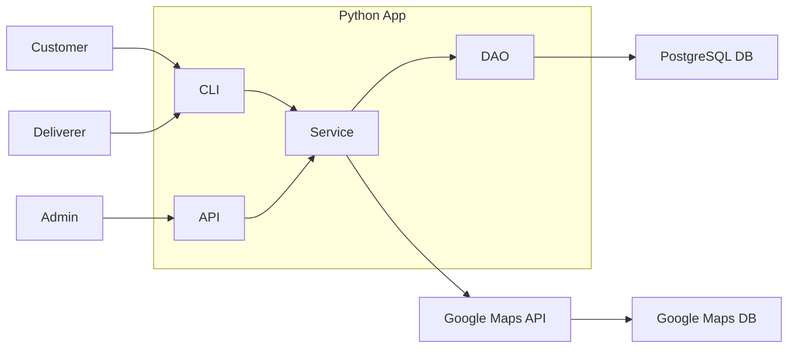

```mermaid
graph LR
    A[Customer] --> C[CLI]
    B[Deliverer] --> C
    D[Admin] --> E[API]
    
    subgraph Python App
        C --> F[Service]
        E --> F
        F --> G[DAO]
    end
    
    G --> H[PostgreSQL DB]
    F --> I[Google Maps API]
    I --> J[Google Maps DB]
```
