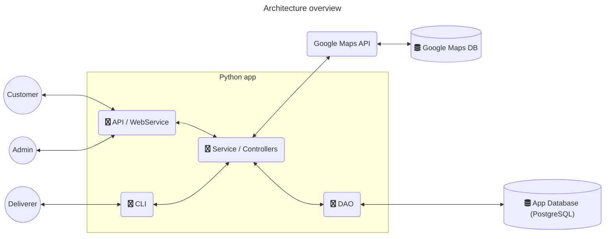

```mermaid

---
title: Architecture overview
---
    graph LR
    USR1((Customer))
    USR2((Deliverer))
    USR3((Admin))
    DB[("fa:fa-database App Database (PostgreSQL)" )]
    API(fa:fa-python API / WebService)
    CLI(fa:fa-python CLI)
    DAO(fa:fa-python DAO)
    SVC(fa:fa-python Service / Controllers )
    MDB[(fa:fa-database Google Maps DB)]
    MDBAPI(Google Maps API)

    USR1<--->API
        subgraph Python app 
            API<-->SVC<-->DAO
            CLI<-->SVC
        end
    USR2<--->CLI
    USR3<--->API

    DAO<--->DB
    MDBAPI <--> MDB
    SVC <--> MDBAPI


```
