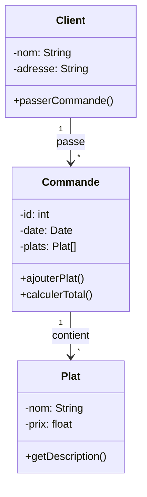

```mermaid
classDiagram
    class Client {
        -nom: String
        -adresse: String
        +passerCommande()
    }

    class Commande {
        -id: int
        -date: Date
        -plats: Plat[]
        +ajouterPlat()
        +calculerTotal()
    }

    class Plat {
        -nom: String
        -prix: float
        +getDescription()
    }

    Client "1" --> "*" Commande : passe
    Commande "1" --> "*" Plat : contient
```
