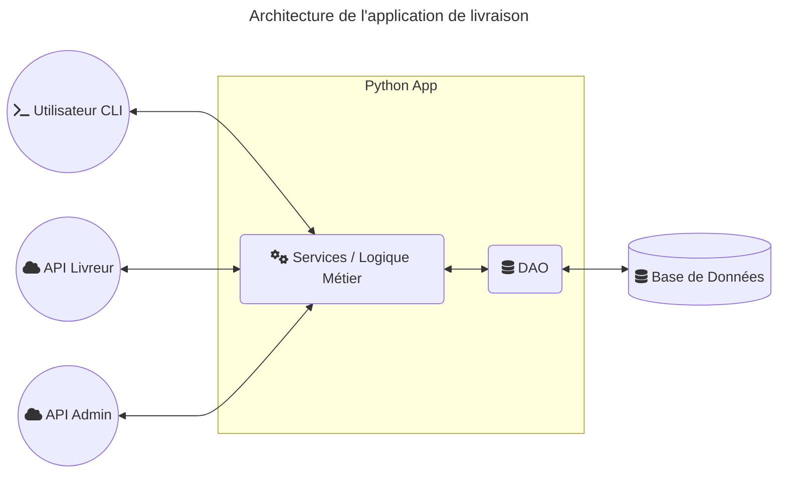

```mermaid
---
title: Architecture de l'application de livraison
---
graph LR
    %% Acteurs / Interfaces
    CLI((fa:fa-terminal Utilisateur CLI))
    API_Livreur((fa:fa-cloud API Livreur))
    API_Admin((fa:fa-cloud API Admin))

    %% Back-end Python app
    subgraph Python App
        SVC(fa:fa-cogs Services / Logique Métier)
        DAO(fa:fa-database DAO)
    end

    %% Base de données
    DB[(fa:fa-database Base de Données)]

    %% Relations
    CLI<--->SVC
    API_Livreur<--->SVC
    API_Admin<--->SVC
    SVC<-->DAO
    DAO<-->DB


```
