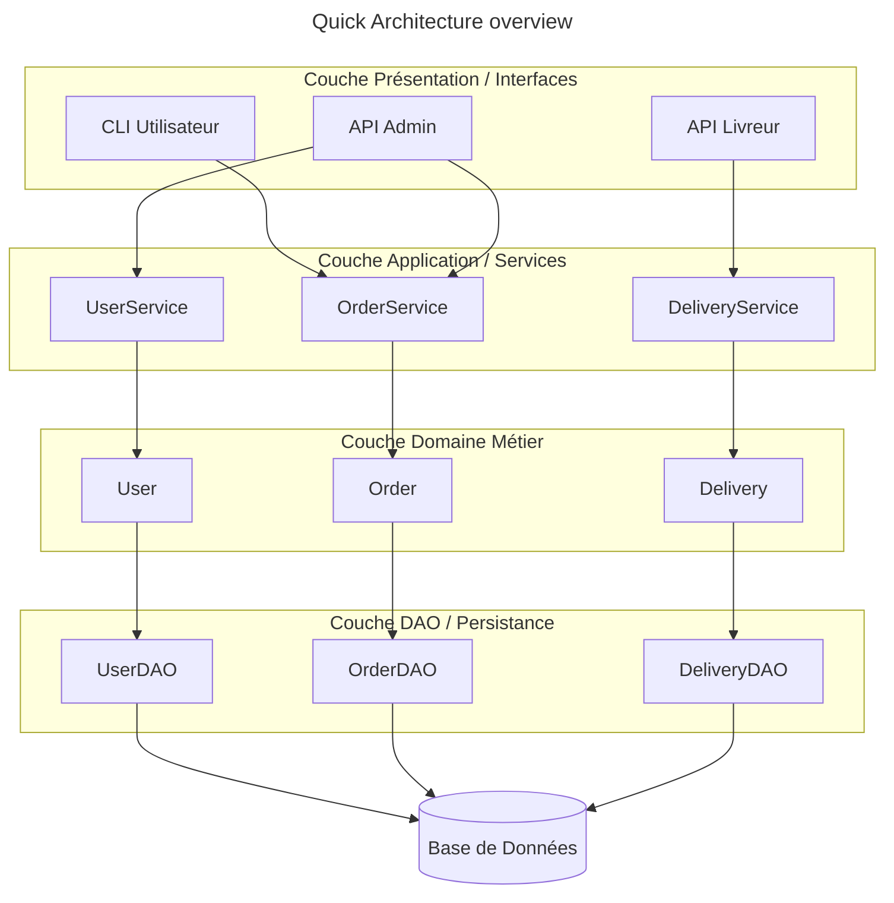

```mermaid
---
title: Quick Architecture overview
---
graph TD

%% Couche Présentation
subgraph Presentation[Couche Présentation / Interfaces]
    CLI[CLI Utilisateur]
    API_Livreur[API Livreur]
    API_Admin[API Admin]
end

%% Couche Application / Services
subgraph ServiceLayer[Couche Application / Services]
    OrderService[OrderService]
    UserService[UserService]
    DeliveryService[DeliveryService]
end

%% Domaine Métier
subgraph Domain[Couche Domaine Métier]
    User[User]
    Order[Order]
    Delivery[Delivery]
end

%% DAO / Persistance
subgraph DAO[Couche DAO / Persistance]
    UserDAO[UserDAO]
    OrderDAO[OrderDAO]
    DeliveryDAO[DeliveryDAO]
end

%% Base de données
DB[(Base de Données)]

%% Liaisons
CLI --> OrderService
API_Livreur --> DeliveryService
API_Admin --> UserService
API_Admin --> OrderService

OrderService --> Order
UserService --> User
DeliveryService --> Delivery

Order --> OrderDAO
User --> UserDAO
Delivery --> DeliveryDAO

UserDAO --> DB
OrderDAO --> DB
DeliveryDAO --> DB

```