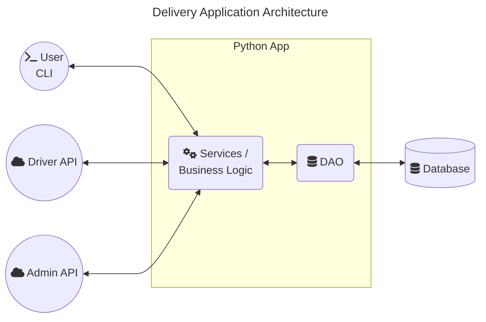

```mermaid

---
title: Delivery Application Architecture
---
graph LR
    %% Actors / Interfaces
    CLI((fa:fa-terminal User \n CLI))
    API_Driver((fa:fa-cloud Driver API))
    API_Admin((fa:fa-cloud Admin API))

    %% Back-end Python app
    subgraph Python App
        SVC(fa:fa-cogs Services / \n Business Logic)
        DAO(fa:fa-database DAO)
    end

    %% Database
    DB[(fa:fa-database Database)]

    %% Relationships
    CLI<--->SVC
    API_Driver<--->SVC
    API_Admin<--->SVC
    SVC<-->DAO
    DAO<-->DB


```
