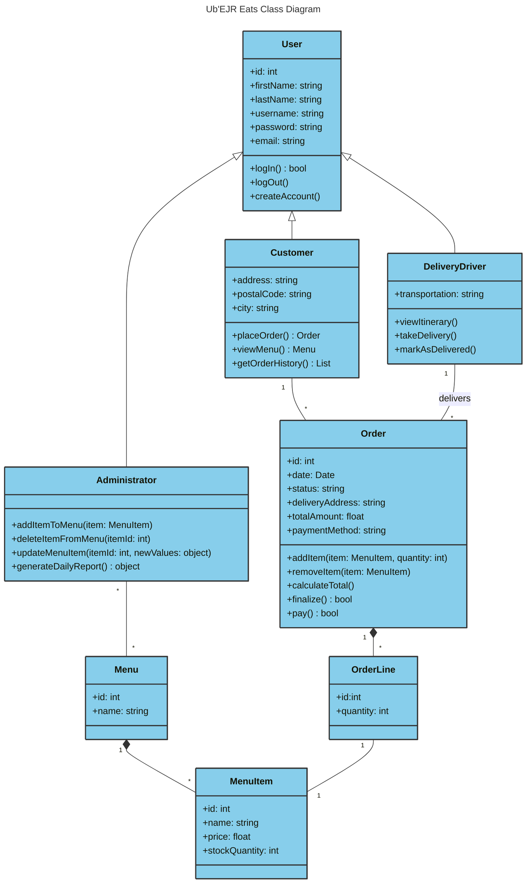

```mermaid

---
title: Ub'EJR Eats Class Diagram
---

classDiagram
    class User {
        +id: int
        +firstName: string
        +lastName: string
        +username: string
        +password: string
        +email: string
        +logIn() bool
        +logOut()
        +createAccount()
    }
    
    class Customer {
        +address: string
        +postalCode: string
        +city: string 
        +placeOrder() Order
        +viewMenu() Menu
        +getOrderHistory() List<Order>
    }
    
    class DeliveryDriver {
        +transportation: string
        +viewItinerary()
        +takeDelivery()
        +markAsDelivered()
    }

    class Administrator {
        +addItemToMenu(item: MenuItem)
        +deleteItemFromMenu(itemId: int)
        +updateMenuItem(itemId: int, newValues: object)
        +generateDailyReport() object
    }
    
    class Order {
        +id: int
        +date: Date
        +status: string
        +deliveryAddress: string
        +totalAmount: float
        +paymentMethod: string
        +addItem(item: MenuItem, quantity: int)
        +removeItem(item: MenuItem)
        +calculateTotal()
        +finalize() bool
        +pay() bool
    }


    class Menu {
        +id: int
        +name: string
    }

    class MenuItem {
        +id: int
        +name: string
        +price: float
        +stockQuantity: int
    }

    class OrderLine {
        +id:int
        +quantity: int
    }

    User <|-- Administrator
    User <|-- Customer
    User <|-- DeliveryDriver
    
    Administrator "*" -- "*" Menu
    
    Menu "1" *-- "*" MenuItem
    
    Customer "1" -- "*" Order
    
    Order "1" *-- "*" OrderLine
    
    OrderLine "1" -- "1" MenuItem
    
    DeliveryDriver "1" -- "*" Order : delivers

    style User fill:#87ceeb,stroke:#333,stroke-width:2px
    style Customer fill:#87ceeb,stroke:#333,stroke-width:2px
    style DeliveryDriver fill:#87ceeb,stroke:#333,stroke-width:2px
    style Administrator fill:#87ceeb,stroke:#333,stroke-width:2px
    style Order fill:#87ceeb,stroke:#333,stroke-width:2px
    style Menu fill:#87ceeb,stroke:#333,stroke-width:2px
    style MenuItem fill:#87ceeb,stroke:#333,stroke-width:2px
    style OrderLine fill:#87ceeb,stroke:#333,stroke-width:2px
```
