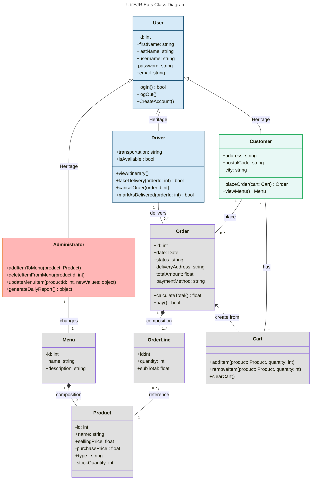

```mermaid

---
title: Ub'EJR Eats Class Diagram
---
classDiagram
%% direction LR  
    class User {
        +id: int
        +firstName: string
        +lastName: string
        +username: string
        -password: string
        +email: string
        +logIn() bool
        +logOut() 
        +CreateAccount()
    }
    
    class Customer {
        +address: string
        +postalCode: string
        +city: string 
        +placeOrder(cart: Cart) Order
        +viewMenu() Menu
    }
    
    class Driver {
        +transportation: string
        +isAvailable : bool
        +viewItinerary()
        +takeDelivery(orderId: int) bool
        +cancelOrder(orderId:int)
        +markAsDelivered(orderId: int) bool
    }

    class Administrator {
        +addItemToMenu(product: Product)
        +deleteItemFromMenu(productId: int)
        +updateMenuItem(productId: int, newValues: object)
        +generateDailyReport() object
    }
    
    class Order {
        +id: int
        +date: Date
        +status: string
        +deliveryAddress: string
        +totalAmount: float
        +paymentMethod: string
        +calculateTotal() float
        +pay() bool
    }

    class Menu {
        -id: int
        +name: string
        +description: string
    }

    class Product {
        -id: int
        +name: string
        +sellingPrice: float
        -purchasePrice : float
        +type : string
        -stockQuantity: int
    }

    class OrderLine {
        +id:int
        +quantity: int
        +subTotal: float
    }

    class Cart {
        +addItem(product: Product, quantity: int)
        +removeItem(product: Product, quantity:int)
        +clearCart()
    }

    %% Relations 
    User <|-- Customer : Heritage
    User <|-- Driver : Heritage
    User <|-- Administrator : Heritage
    
    Customer "1" -- "0..*" Order : place 

    Order "1" *-- "1..*" OrderLine : composition

    OrderLine "0..*" -- "1" Product : reference

    Driver "1" -- "0..*" Order : delivers 

    Administrator "1" -- "1" Menu : changes

    Menu "1" *-- "0..*" Product : composition

    Customer "1" -- "1" Cart : has 

    Order <.. Cart : create from
    
    %% Styles pour la lisibilité
    style User fill:#D6EAF8,stroke:#1A5276,stroke-width:2px
    style Customer fill:#E8F8F5,stroke:#27AE60,stroke-width:2px
    style Driver fill:#D6EAF8,stroke:#1A5276
    style Administrator fill:#FFB6B6,stroke:#E67E22
    
    style Order fill:#E0E0E0,stroke=#808080,stroke-width:2px
    style OrderLine fill:#E0E0E0,stroke=#808080

    style Menu fill:#E0E0E0,stroke=#808080,stroke-width:2px
    style Product fill:#E0E0E0,stroke=#808080
    style Cart fill:#E0E0E0,stroke=#808080

```