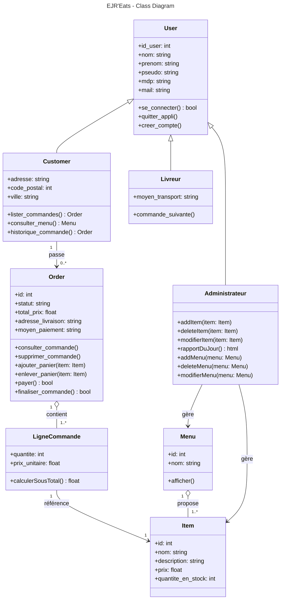

```mermaid
---
title: EJR'Eats - Class Diagram
---

classDiagram
    class User {
        +id_user: int
        +nom: string
        +prenom: string
        +pseudo: string
        +mdp: string
        +mail: string
        +se_connecter() bool
        +quitter_appli()
        +creer_compte()
    }
    
    class Customer {
        +adresse: string
        +code_postal: int
        +ville: string 
        +lister_commandes() Order
        +consulter_menu() Menu
        +historique_commande() Order
    }
    
    class Livreur {
        +moyen_transport: string
        +commande_suivante()
    }

    class Administrateur {
        +addItem(item: Item)
        +deleteItem(item: Item)
        +modifierItem(item: Item)
        +rapportDuJour() html
        +addMenu(menu: Menu)
        +deleteMenu(menu: Menu)
        +modifierMenu(menu: Menu)
    }
    
    class Order {
        +id: int
        +statut: string
        +total_prix: float 
        +adresse_livraison: string
        +moyen_paiement: string
        +consulter_commande()
        +supprimer_commande()
        +ajouter_panier(item: Item)
        +enlever_panier(item: Item)
        +payer() bool
        +finaliser_commande() bool
    }

    class Item {
        +id: int
        +nom: string
        +description: string
        +prix: float
        +quantite_en_stock: int
    }

    class Menu {
        +id: int
        +nom: string
        +afficher()
    }

    class LigneCommande {
        +quantite: int
        +prix_unitaire: float
        +calculerSousTotal() float
    }

    %% Héritages
    User <|-- Livreur
    User <|-- Customer
    User <|-- Administrateur

    %% Relations
    Customer "1" --> "0..*" Order : passe
    Order "1" o-- "1..*" LigneCommande : contient
    LigneCommande "1" --> "1" Item : référence
    Menu "1" o-- "1..*" Item : propose
    Administrateur --> Menu : gère
    Administrateur --> Item : gère

```