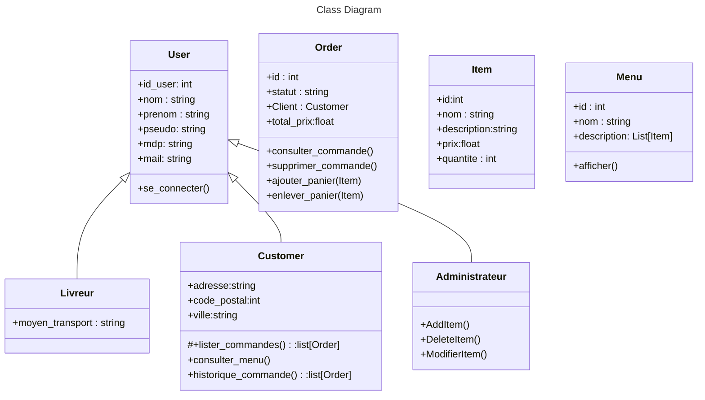

```mermaid
---
title: Class Diagram
---

classDiagram
    class User {
        +id_user: int
        +nom : string
        +prenom : string
        +pseudo: string
        +mdp: string
        +mail: string
        +se_connecter()
    }
    
    class Customer {
        +adresse:string
        +code_postal:int
        +ville:string 
        #+lister_commandes():list[Order]
        +consulter_menu()
        +historique_commande():list[Order]
    }
    
    class Livreur {
        +moyen_transport : string
    }

    class Administrateur {
        +AddItem()
        +DeleteItem()
        +ModifierItem()
    }
    
    class Order {
        +id : int
        +statut : string
        +Client : Customer
        +total_prix:float 
        +consulter_commande()
        +supprimer_commande()
        +ajouter_panier(Item)
        +enlever_panier(Item)
    }

    class Item {
        +id:int
        +nom : string
        +description:string
        +prix:float
        +quantite : int
    }

    class Menu{
      +id : int
      +nom : string
      +description: List[Item]
      +afficher()
    }

    User <|-- Livreur
    User <|-- Customer
    User <|-- Administrateur
```

