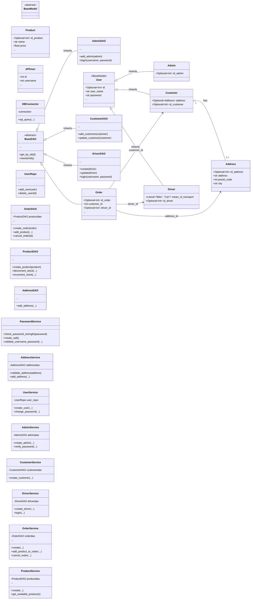

```mermaid
classDiagram
    direction LR

    %% ==================================
    %% 1. CLASSES ENTITÉS (Pydantic Models)
    %% ==================================
    class BaseModel {
        <<abstract>>
    }
    class Address {
        +Optional~int~ id_address
        +str address
        +int postal_code
        +str city
    }
    class Product {
        +Optional~int~ id_product
        +str name
        +float price
        ...
    }
    class Order {
        +Optional~int~ id_order
        +int customer_id
        +Optional~int~ driver_id
        ...
    }
    class User {
        <<BaseModel>>
        +Optional~int~ id
        +str user_name
        +str password
        ...
    }
    class Admin {
        +Optional~int~ id_admin
    }
    class Customer {
        +Optional~Address~ address
        +Optional~int~ id_customer
    }
    class Driver {
        +Literal~"Bike", "Car"~ mean_of_transport
        +Optional~int~ id_driver
    }
    class APIUser {
        +int id
        +str username
        ...
    }
    
    
    %% ==================================
    %% 2. CLASSES DAO/REPO
    %% ==================================
    class DBConnector {
        -connection
        +sql_query(...)
    }
    class BaseDAO {
        <<abstract>>
        +get_by_id(id)
        +save(entity)
        ...
    }
    class UserRepo {
        +add_user(user)
        +delete_user(id)
        ...
    }
    class AdminDAO {
        +add_admin(admin)
        +login(username, password)
        ...
    }
    class CustomerDAO {
        +add_customer(customer)
        +update_customer(customer)
        ...
    }
    class DriverDAO {
        +create(driver)
        +update(driver)
        +login(username, password)
        ...
    }
    class OrderDAO {
        -ProductDAO productdao
        +create_order(order)
        +add_product(...)
        +cancel_order(id)
        ...
    }
    class ProductDAO {
        +create_product(product)
        +decrement_stock(...)
        +increment_stock(...)
        ...
    }
    class AddressDAO {
        +add_address(...)
        ...
    }


    %% ==================================
    %% 3. CLASSES SERVICE (Logique Métier)
    %% ==================================
    class PasswordService {
        +check_password_strength(password)
        +create_salt()
        +validate_username_password(...)
    }

    class AddressService {
        -AddressDAO addressdao
        +validate_address(address)
        +add_address(...)
    }
    
    class UserService {
        -UserRepo user_repo
        +create_user(...)
        +change_password(...)
    }

    class AdminService {
        -AdminDAO admindao
        +create_admin(...)
        +verify_password(...)
    }
    class CustomerService {
        -CustomerDAO customerdao
        +create_customer(...)
    }
    class DriverService {
        -DriverDAO driverdao
        +create_driver(...)
        +login(...)
    }
    class OrderService {
        -OrderDAO orderdao
        +create(...)
        +add_product_to_order(...)
        +cancel_order(...)
        ...
    }
    class ProductService {
        -ProductDAO productdao
        +create(...)
        +get_available_products()
        ...
    }


    %% ==================================
    %% 4. RELATIONS
    %% ==================================

    %% A. Héritage Entités
    User <|-- Admin : Inherits
    User <|-- Customer : Inherits
    User <|-- Driver : Inherits

    %% B. Relations Entités (simplifiées)
    Order --> Customer : customer_id
    Order --> Driver : driver_id
    Order --> Address : address_id
    Customer "1" o-- "0..1" Address : has

    %% C. Héritage DAO (pour montrer l'abstraction)
    BaseDAO <|-- AdminDAO : Inherits
    BaseDAO <|-- CustomerDAO : Inherits
    BaseDAO <|-- DriverDAO : Inherits
    BaseDAO <|-- Order
       


```

