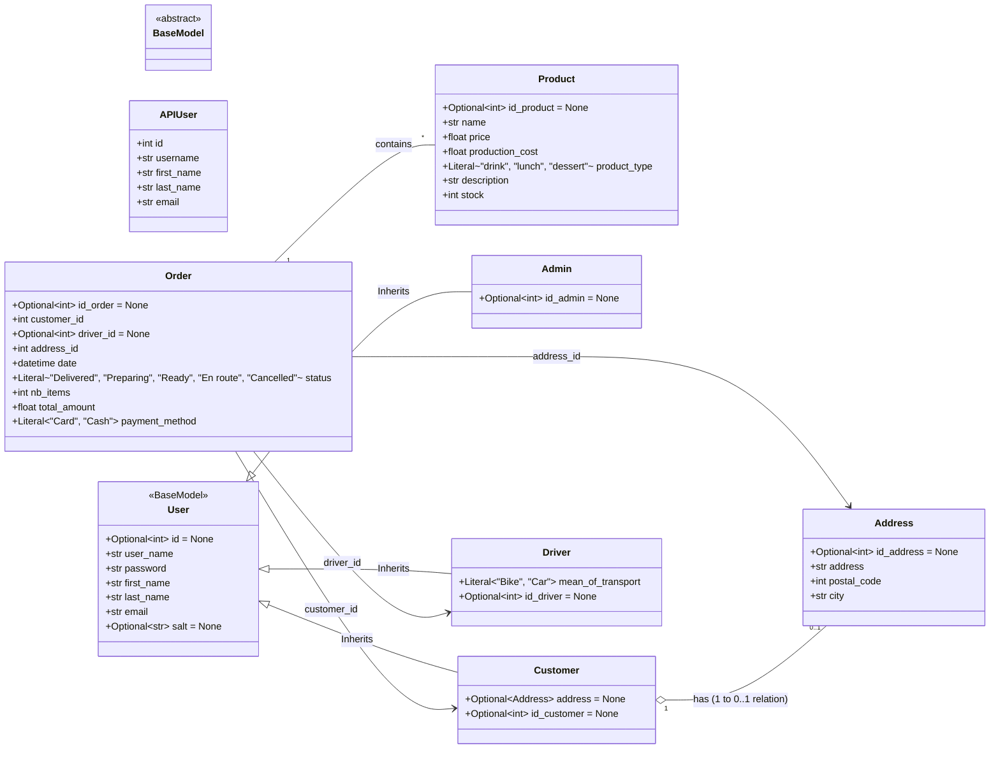

```mermaid
classDiagram
    direction LR

    %% Base Classes
    class BaseModel {
        <<abstract>>
    }

    class Address {
        +Optional~int~ id_address = None
        +str address
        +int postal_code
        +str city
    }

    class APIUser {
        +int id
        +str username
        +str first_name
        +str last_name
        +str email
    }

    class Product {
        +Optional~int~ id_product = None
        +str name
        +float price
        +float production_cost
        +Literal~"drink", "lunch", "dessert"~ product_type
        +str description
        +int stock
    }

    class Order {
        +Optional~int~ id_order = None
        +int customer_id
        +Optional~int~ driver_id = None
        +int address_id
        +datetime date
        +Literal~"Delivered", "Preparing", "Ready", "En route", "Cancelled"~ status
        +int nb_items
        +float total_amount
        +Literal~"Card", "Cash"~ payment_method
    }

    %% User Classes (Inheritance)
    class User {
        <<BaseModel>>
        +Optional~int~ id = None
        +str user_name
        +str password
        +str first_name
        +str last_name
        +str email
        +Optional~str~ salt = None
    }

    class Admin {
        +Optional~int~ id_admin = None
    }

    class Customer {
        +Optional~Address~ address = None
        +Optional~int~ id_customer = None
    }

    class Driver {
        +Literal~"Bike", "Car"~ mean_of_transport
        +Optional~int~ id_driver = None
    }

    %% -------------------- RELATIONS --------------------

    %% Inheritance: Subclasses inherit from User
    User <|-- Admin : Inherits
    User <|-- Customer : Inherits
    User <|-- Driver : Inherits

    %% Association: Foreign key relationships in Order
    Order --> Customer : customer_id
    Order --> Driver : driver_id
    Order --> Address : address_id

    %% Association: Explicit/Implicit relations
    Customer "1" o-- "0..1" Address : has (1 to 0..1 relation)
    
    %% Assumption: An Order contains multiple Products
    Order "1" -- "*" Product : contains

```

