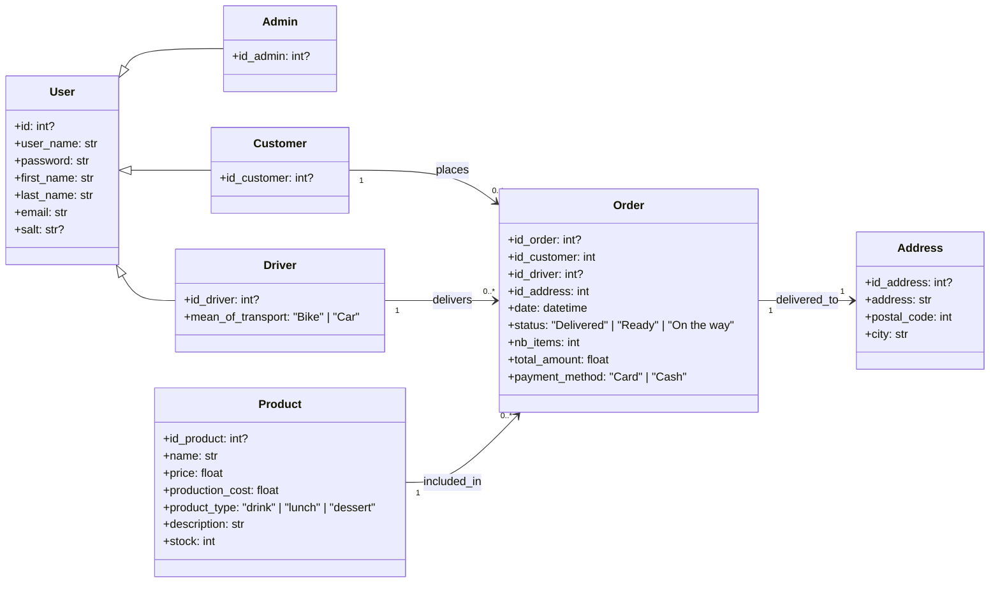

```mermaid
classDiagram
direction LR

class User {
    +id: int?
    +user_name: str
    +password: str
    +first_name: str
    +last_name: str
    +email: str
    +salt: str?
}

class Admin {
    +id_admin: int?
}

class Customer {
    +id_customer: int?
}

class Driver {
    +id_driver: int?
    +mean_of_transport: "Bike" | "Car"
}

class Address {
    +id_address: int?
    +address: str
    +postal_code: int
    +city: str
}

class Product {
    +id_product: int?
    +name: str
    +price: float
    +production_cost: float
    +product_type: "drink" | "lunch" | "dessert"
    +description: str
    +stock: int
}

class Order {
    +id_order: int?
    +id_customer: int
    +id_driver: int?
    +id_address: int
    +date: datetime
    +status: "Delivered" | "Ready" | "On the way"
    +nb_items: int
    +total_amount: float
    +payment_method: "Card" | "Cash"
}

User <|-- Admin
User <|-- Customer
User <|-- Driver

Customer "1" --> "0..*" Order : places
Driver "1" --> "0..*" Order : delivers

Order "1" --> "1" Address : delivered_to

Product "1" --> "0..*" Order : included_in
```

